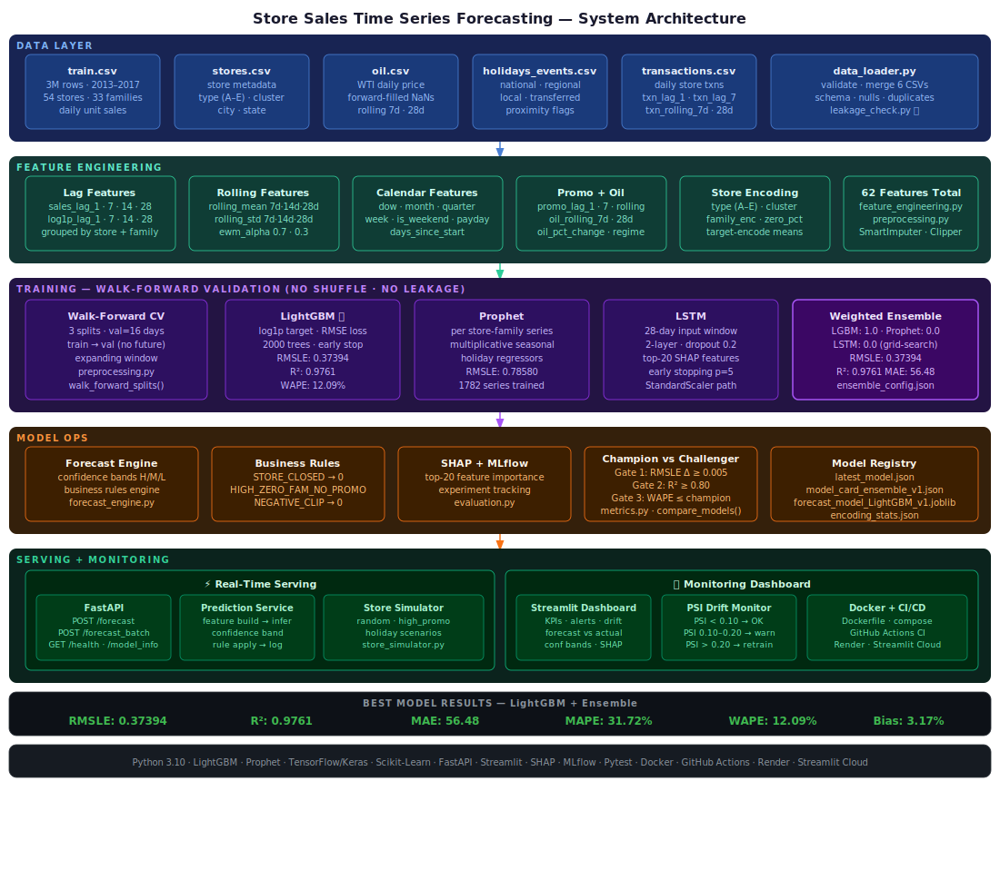
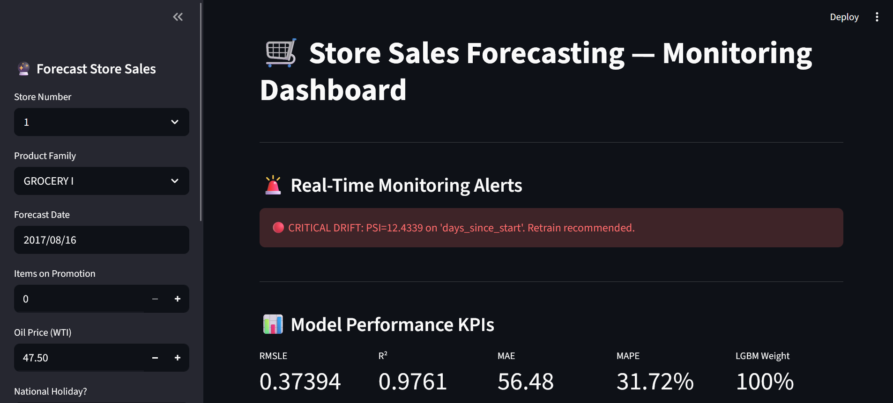
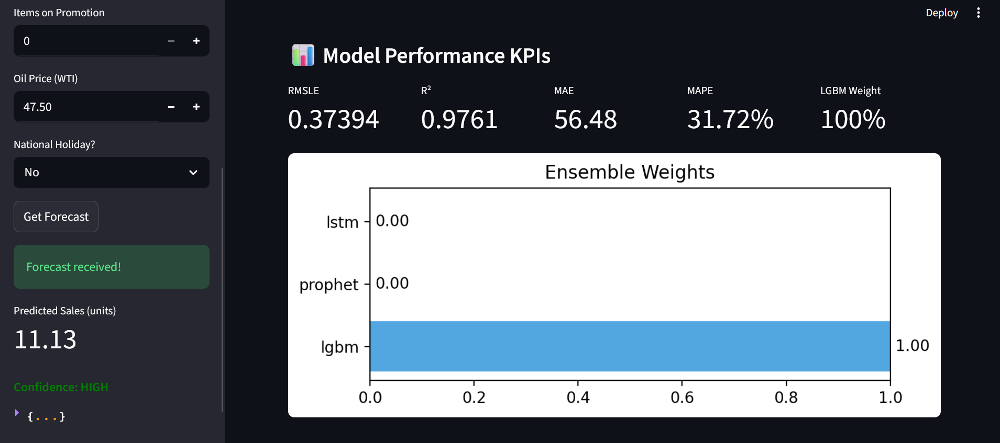
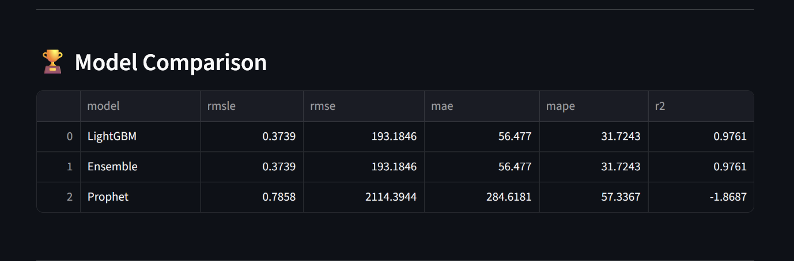
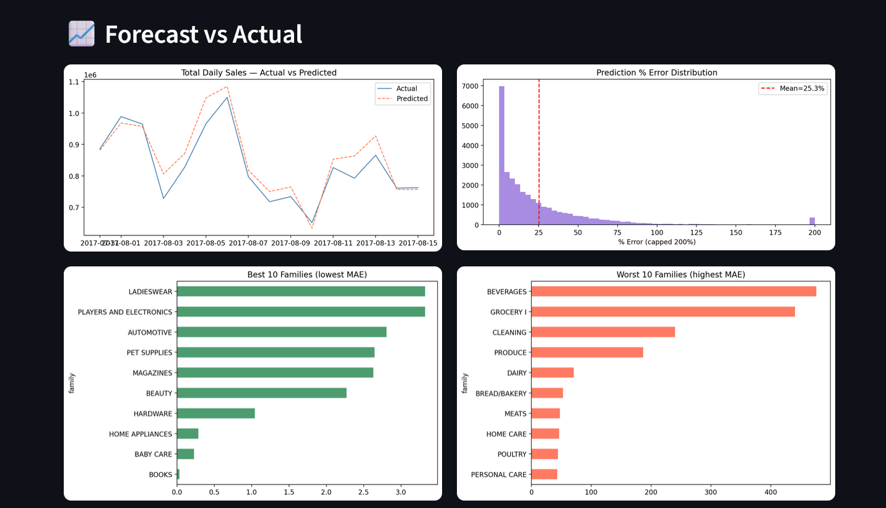
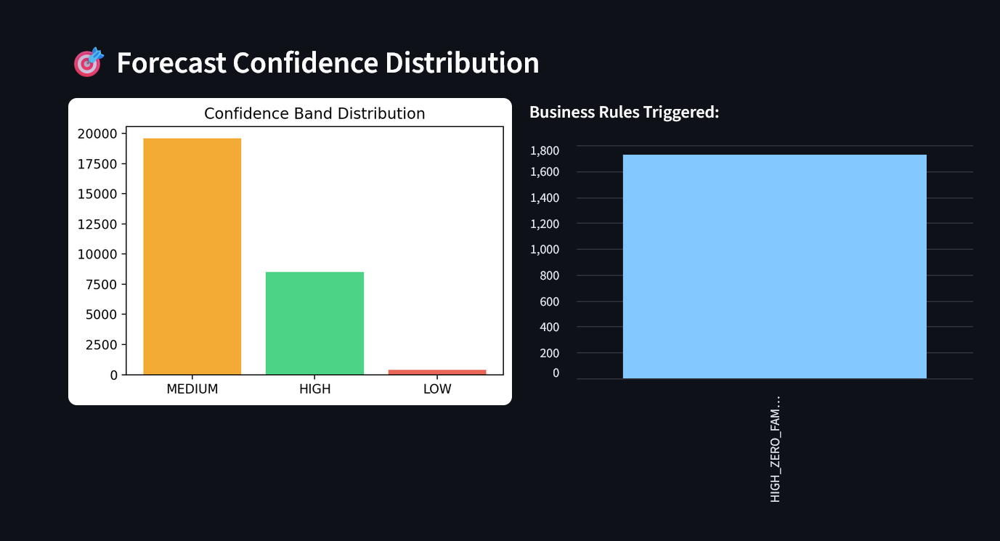
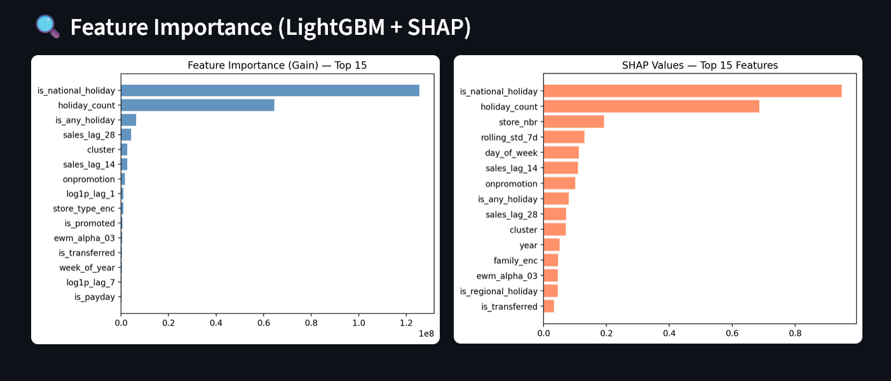
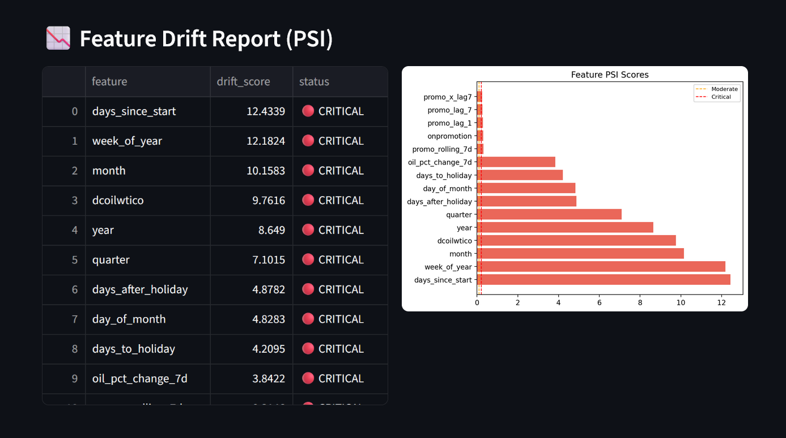
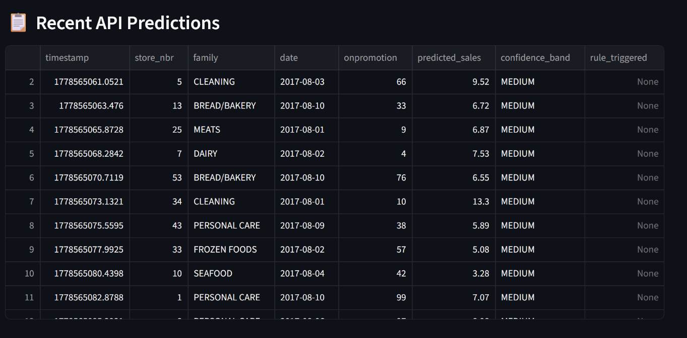
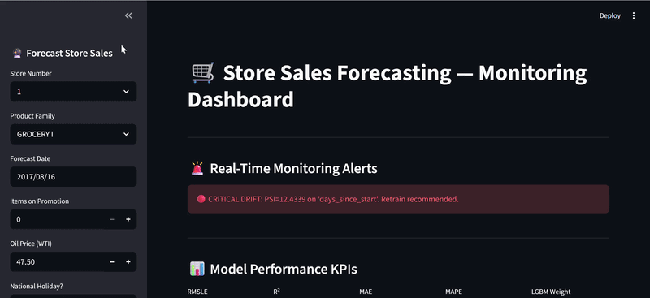

# 🛒 Store Sales Time Series Forecasting

⭐ **If you find this project useful, consider giving it a star!**


Production-grade end-to-end time series forecasting system for **Corporación Favorita** (Ecuador's largest grocery retailer) — Kaggle Store Sales Competition.

Forecasts unit sales for **54 stores × 33 product families × 16 days** using a **LightGBM + Prophet + LSTM ensemble** with confidence bands, business rules, real-time API, PSI drift monitoring, and Champion vs Challenger model promotion gates.

---

## 🚀 Project Overview

- **Dataset:** Kaggle Store Sales Time Series Forecasting (~3M rows, 2013–2017)
- **Target:** Daily unit sales per (store, family) pair — RMSLE metric
- **Models:** LightGBM (primary) + Prophet (seasonality) + LSTM (sequence) → Weighted Ensemble
- **Pipeline:** 20-step end-to-end training → Forecast Engine → API → Dashboard → Docker

---

## 🏗 System Architecture



```
6 Raw CSVs (train, test, stores, oil, holidays, transactions)
    ↓
Data Validation + Merge (data_loader.py)  ← leakage_check.py ✅
    ↓
Feature Engineering (feature_engineering.py)
  ├── Lag features        : sales_lag_1, 7, 14, 28  +  log1p variants
  ├── Rolling features    : rolling_mean/std — 7d, 14d, 28d  +  ewm 0.7/0.3
  ├── Calendar features   : dow, month, year, week, quarter, is_weekend, payday
  ├── Promotion features  : onpromotion lags + rolling + promo_x_lag7
  ├── Oil features        : dcoilwtico + rolling + pct_change + regime flag
  ├── Transaction features: txn_lag_1, txn_lag_7, txn_rolling_7d/28d
  ├── Holiday flags       : national/regional/local + proximity days
  ├── Store encoding      : type (A–E), cluster, target-encoded means
  └── Family encoding     : label + target encode + zero_pct flag
    ↓  [62 features total]
Two Preprocessor Paths (preprocessing.py)
  ├── TREE PATH (LightGBM): SmartImputer → Clipper only (no scaling)
  └── LSTM PATH          : SmartImputer → Clipper → log1p → StandardScaler
    ↓
Walk-Forward Validation (3 splits · val=16 days · NO shuffle · NO leakage)
    ↓
┌──────────────────┬─────────────────────┬──────────────────┐
│   LightGBM ⭐    │   Prophet           │   LSTM            │
│   log1p target   │   per store-family  │   28-day window   │
│   2000 trees     │   multiplicative    │   2-layer LSTM    │
│   early stopping │   holiday regressors│   dropout 0.2     │
│   RMSLE: 0.37394 │   RMSLE: 0.78580   │   top-20 features │
└────────┬─────────┴──────────┬──────────┴────────┬──────────┘
         └────────────────────┴───────────────────┘
                              ↓
              Weighted Ensemble (LGBM:1.0 · Prophet:0.0 · LSTM:0.0)
                              ↓
              Forecast Engine (forecast_engine.py)
              ├── Confidence bands : HIGH / MEDIUM / LOW
              └── Business rules  : STORE_CLOSED | HIGH_ZERO_FAMILY_NO_PROMO | NEGATIVE_CLIP
                              ↓
    ┌─────────────────────────────────────────────────┐
    │  Champion vs Challenger (3-gate promotion)       │
    │  Gate 1: RMSLE Δ ≥ 0.005                        │
    │  Gate 2: R² ≥ 0.80                              │
    │  Gate 3: WAPE ≤ Champion WAPE                   │
    └─────────────────────────────────────────────────┘
                              ↓
         ┌────────────────────────────────────┐
         │  FastAPI /forecast endpoint         │
         │  Streamlit Monitoring Dashboard     │
         │  PSI Drift Monitor                  │
         │  Docker + GitHub Actions CI/CD      │
         └────────────────────────────────────┘
```

---

## 🌐 Live Demo

🚀 **Forecast API (Live on Render)**
👉 https://store-sales-forecasting.onrender.com

📊 **Monitoring Dashboard (Live on Streamlit Cloud)**
👉 https://store-sales-forecasting.streamlit.app

📄 **API Docs (Swagger UI)**
👉 https://store-sales-forecasting.onrender.com/docs

---

## 📊 Model Results

| Model | RMSLE | RMSE | MAE | MAPE | WAPE | Bias% | R² |
|-------|-------|------|-----|------|------|-------|----|
| **LightGBM** | **0.37394** | 193.18 | 56.48 | 31.72% | 12.09% | 3.17% | **0.9761** |
| **Ensemble** | **0.37394** | 193.18 | 56.48 | 31.72% | 12.09% | 3.17% | **0.9761** |
| Prophet | 0.78580 | 2114.39 | 284.62 | 57.34% | 60.93% | 29.46% | -1.8687 |

> **Note:** Ensemble weight = LGBM:1.0 · Prophet:0.0 · LSTM:0.0 (grid-search result — LightGBM dominates cleanly).

---

## 📸 Screenshots

### Dashboard — Full UI


### Model Performance KPIs


### Model Comparison


### Forecast vs Actual


### Forecast Confidence Distribution


### Feature Importance (LightGBM + SHAP)


### Feature Drift Report (PSI)


### Recent API Predictions


---

## 🎬 System Demo



---

## 🎯 Forecast Engine

Unlike basic regression, this system outputs structured forecasts:

| Output | Description |
|--------|-------------|
| `predicted_sales` | Final unit sales forecast (rules applied) |
| `confidence_band` | HIGH / MEDIUM / LOW uncertainty |
| `rule_triggered` | Business rule override (if any) |
| `is_holiday_forecast` | Forecast on/near national holiday |
| `is_promo_forecast` | Promotion active on forecast date |
| `days_ahead` | Days beyond training window |

**Confidence Band Logic:**

| Factor | Uncertainty Added |
|--------|-------------------|
| family_zero_pct > 0.50 | +1 |
| family_zero_pct > 0.80 | +1 |
| is_national_holiday | +1 |
| is_promoted | +1 |
| days_since_train_end > 7 | +1 |
| days_since_train_end > 30 | +2 |
| Score = 0 → HIGH · 1–2 → MEDIUM · 3+ → LOW | |

**Business Rules (override ML):**

| Rule | Trigger | Action |
|------|---------|--------|
| `STORE_CLOSED` | Store flagged as closed | sales = 0 |
| `HIGH_ZERO_FAMILY_NO_PROMO` | Family >90% zero sales + no promotion | sales = 0 |
| `NEGATIVE_CLIP` | Model predicted negative | clip to 0 |

---

## ⚔️ Champion vs Challenger — 3-Gate Promotion

| Gate | Condition | Threshold |
|------|-----------|-----------|
| Gate 1 — RMSLE | Challenger RMSLE improvement | ≥ 0.005 |
| Gate 2 — R² | Challenger R² | ≥ 0.80 |
| Gate 3 — WAPE | Challenger WAPE ≤ Champion WAPE | Volume-weighted |

All 3 gates must pass for challenger to be promoted to production.

---

## ⚡ Real-Time Forecast API

### Run locally
```bash
python scripts/run_api.py
```

### Endpoints

| Method | Endpoint | Description |
|--------|----------|-------------|
| GET | `/` | Home message |
| GET | `/health` | Model load status |
| GET | `/model_info` | Registry + metrics |
| POST | `/forecast` | Single (store, family, date) forecast |
| POST | `/forecast_batch` | Multiple rows forecast |
| GET | `/stores` | List 54 stores |
| GET | `/families` | List 33 product families |

### Example Request
```json
{
  "store_nbr": 1,
  "family": "GROCERY I",
  "date": "2017-08-16",
  "onpromotion": 5,
  "dcoilwtico": 47.5,
  "is_national_holiday": 0
}
```

### Example Response
```json
{
  "store_nbr": 1,
  "family": "GROCERY I",
  "forecast_date": "2017-08-16",
  "predicted_sales": 1234.56,
  "confidence_band": "HIGH",
  "rule_triggered": null,
  "is_holiday_forecast": false,
  "is_promo_forecast": true,
  "days_ahead": 1,
  "latency_seconds": 0.032
}
```

---

## 🔁 Store Simulator

```bash
python scripts/run_simulation.py
```

Supports 3 scenarios: `random` | `high_promo` | `holiday`

---

## 🐳 Docker

```bash
# API only
docker build -t store-sales-api .
docker run -p 8000:8000 -v ./forecast_models:/app/forecast_models store-sales-api

# API + Dashboard together
docker compose up --build
```

---

## ⚙️ How to Run

### 1. Install dependencies
```bash
pip install -r requirements.txt
```

### 2. Train Model
```bash
python scripts/train_model.py
```

### 3. Start API
```bash
python scripts/run_api.py
```

### 4. Run Simulator
```bash
python scripts/run_simulation.py
```

### 5. Start Dashboard
```bash
python scripts/run_dashboard.py
```

---

## 🧪 Running Tests

```bash
pytest tests/ -v
pytest tests/ -v --cov=src --cov-report=term-missing
```

39 tests · covering: Clipper, SmartImputer, classify_feature_columns, drop_lag_nans, walk_forward_splits, RMSLE, RMSE, MAE, MAPE, PSI, confidence bands, business rules, score_forecast, calendar features, lag features.

---

## 📂 Project Structure

```
store-sales-forecasting/
├── src/
│   ├── config.py              ← constants, paths, model params, PSI thresholds
│   ├── data_loader.py         ← load + validate + merge 6 CSVs
│   ├── feature_engineering.py ← lag, rolling, calendar, promo, oil, txn (62 features)
│   ├── preprocessing.py       ← Clipper, SmartImputer, tree/LSTM paths
│   ├── metrics.py             ← RMSLE, WAPE, Bias, PSI, drift report, compare_models
│   ├── model_tuning.py        ← LightGBM, Prophet, LSTM, ensemble grid-search
│   ├── evaluation.py          ← eval, SHAP, save, model card, MLflow
│   ├── forecast_engine.py     ← confidence bands + business rules
│   ├── leakage_check.py       ← time-series leakage detection
│   └── training_pipeline.py   ← 20-step orchestration
│
├── serving/
│   ├── __init__.py
│   └── forecast_api.py        ← FastAPI endpoints
│
├── monitoring/
│   ├── __init__.py
│   └── monitoring_dashboard.py← Streamlit dashboard
│
├── simulation/
│   ├── __init__.py
│   └── store_simulator.py     ← 3-scenario API simulator
│
├── services/
│   ├── __init__.py
│   └── prediction_service.py  ← inference helper
│
├── scripts/
│   ├── train_model.py
│   ├── run_api.py
│   ├── run_dashboard.py
│   └── run_simulation.py
│
├── tests/
│   ├── __init__.py
│   └── test_pipeline_core.py  ← 39 pytest unit tests
│
├── data/
│   └── sample/                ← sample CSVs for demo/CI
│
├── docs/
│   ├── architecture/
│   │   └── system_architecture.svg
│   ├── screenshots/
│   │   ├── dashboard_full_ui.png
│   │   ├── model_performance.png
│   │   ├── model_comparison.png
│   │   ├── forecast_vs_actual.png
│   │   ├── forecast_confidence_distribution.png
│   │   ├── feature_importance.png
│   │   ├── feature_drift_report_and_scores.png
│   │   └── recent-api_predictions.png
│   ├── reports/
│   │   ├── best_model.png
│   │   ├── models_evaluation.png
│   │   └── test_coverage.png
│   └── gifs/
│       └── system_demo.gif
│
├── forecast_models/           ← saved models + artifacts
│   ├── forecast_model_LightGBM_v1.joblib
│   ├── tree_preprocessor.joblib
│   ├── prophet_models.joblib
│   ├── encoding_stats.json
│   ├── ensemble_config.json
│   ├── latest_model.json
│   ├── model_card_ensemble_v1.json
│   ├── monitor_scores.csv
│   ├── feature_drift_report.csv
│   ├── model_experiment_results.csv
│   └── df_scored.csv
│
├── logs/
│   └── prediction_logs.csv
│
├── notebooks/
│   ├── store_sales_eda.ipynb  ← 28-step professional EDA
│   └── store_sales_eda.html
│
├── Dockerfile
├── Dockerfile.dashboard
├── docker-compose.yml
├── .github/workflows/ci.yml   ← GitHub Actions CI
├── requirements.txt
├── requirements_api.txt
└── README.md
```

---

## 🛠 Tech Stack

| Category | Tools |
|----------|-------|
| **Core ML** | LightGBM · Prophet · TensorFlow/Keras · Scikit-Learn |
| **Interpretability** | SHAP |
| **Experiment Tracking** | MLflow |
| **API** | FastAPI · Uvicorn · Pydantic |
| **Dashboard** | Streamlit · Matplotlib |
| **Testing** | Pytest · pytest-cov |
| **Containerization** | Docker · Docker Compose |
| **CI/CD** | GitHub Actions |
| **Deployment** | Render (API) · Streamlit Cloud (Dashboard) |
| **Language** | Python 3.10 |

---

## 👤 Author

**Narendra Kalam**
MSc Computer Science · Gold Medalist NASSCOM

📧 kalamnarendra2001@gmail.com
🔗 [LinkedIn](https://www.linkedin.com/in/narendra-kalam)
🐙 [GitHub](https://github.com/narendrakalam2001)