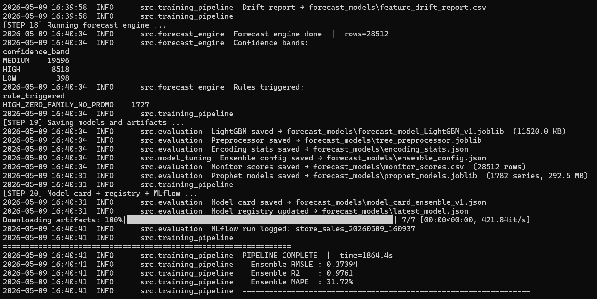
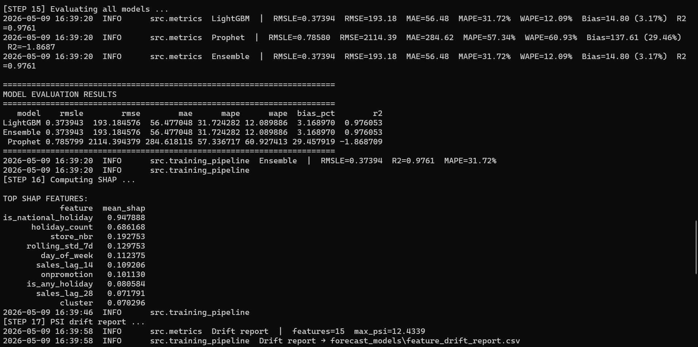
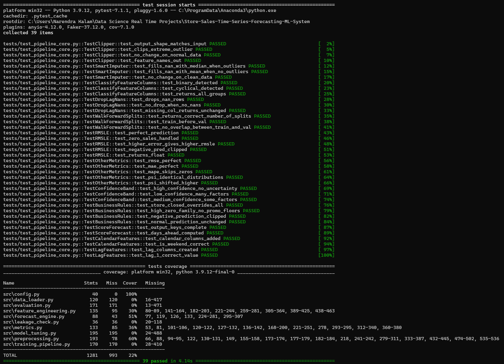

# 🛒 Store Sales Time Series Forecasting

⭐ **If you find this project useful, consider giving it a star!**


Production-grade end-to-end time series forecasting system for **Corporación Favorita**
(Ecuador's largest grocery retailer) — Kaggle Store Sales Competition.

Forecasts daily unit sales for **54 stores × 33 product families × 16 days ahead** using a
**LightGBM + Prophet + LSTM weighted ensemble** with confidence bands, business rules,
Champion vs Challenger promotion gates, PSI drift monitoring, and real-time API + dashboard.

---

## 🚀 Project Overview

This project builds a complete **Retail-grade Demand Forecasting System** that mirrors
how large retailers forecast inventory and procurement needs at scale:

- Automated ML training pipeline (**3 models** — LightGBM, Prophet, LSTM — with weighted ensemble)
- Rich feature engineering — **62 engineered features** (lag, rolling, calendar, promo, oil, transactions, encoding)
- Walk-forward time series validation (3 splits · 16-day val · **no shuffle · no leakage**)
- Two preprocessor paths — tree path (SmartImputer + Clipper) and LSTM path (+ log1p + StandardScaler)
- **3-tier confidence band engine** (HIGH / MEDIUM / LOW) based on uncertainty scoring
- **3-gate Champion vs Challenger** model promotion system (RMSLE, R², WAPE)
- Business rules engine — STORE_CLOSED, HIGH_ZERO_FAMILY_NO_PROMO, NEGATIVE_CLIP
- SHAP explainability (top-20 feature importance)
- MLflow experiment tracking
- PSI drift monitoring with visual bar chart
- Leakage detection before training (`leakage_check.py`)
- **39 pytest unit tests** — 39/39 passing
- Real-time FastAPI + Store Simulator (3 scenarios)
- Streamlit monitoring dashboard with real-time alerts
- Docker-ready (API + Dashboard)

---

## 💡 Why This Project Matters

Retailers don't just predict sales — they translate forecasts into structured outputs
with confidence levels and business rules that override ML when the signal is obvious
(e.g. a family with >90% zero-sales history and no active promotion predicts zero).
This system simulates that exact workflow: confidence bands and rules are applied
**after** the ML prediction, and WAPE/RMSLE drive the Champion vs Challenger gates —
matching real demand planning pipelines used at large grocery and FMCG retailers.

---

## 🌐 Live Demo

🚀 **Forecast API (Live on Render)**
👉 [store-sales-forecasting-mlops.onrender.com](https://store-sales-forecasting-mlops.onrender.com)

📊 **Monitoring Dashboard (Live on Streamlit Cloud)**
👉 [store-sales-forecasting-mlops.streamlit.app](https://store-sales-forecasting-mlops.streamlit.app)

📄 **API Docs (Swagger UI)**
👉 [store-sales-forecasting-mlops.onrender.com/docs](https://store-sales-forecasting-mlops.onrender.com/docs)

---

## 🏗 System Architecture


```
6 Raw CSVs (train, test, stores, oil, holidays, transactions)
    ↓
Data Validation + Merge (data_loader.py)  ← leakage_check.py ✅
    ↓
Feature Engineering (feature_engineering.py)
  ├── Lag features        : sales_lag_1, 7, 14, 28  +  log1p variants
  ├── Rolling features    : rolling_mean/std — 7d, 14d, 28d  +  ewm 0.7/0.3
  ├── Calendar features   : dow, month, year, week, quarter, is_weekend, payday
  ├── Promotion features  : onpromotion lags + rolling + promo_x_lag7
  ├── Oil features        : dcoilwtico + rolling + pct_change + regime flag
  ├── Transaction features: txn_lag_1, txn_lag_7, txn_rolling_7d/28d
  ├── Holiday flags       : national/regional/local + proximity days
  ├── Store encoding      : type (A–E), cluster, target-encoded means
  └── Family encoding     : label + target encode + zero_pct flag
    ↓  [62 features total]
Two Preprocessor Paths (preprocessing.py)
  ├── TREE PATH (LightGBM): SmartImputer → Clipper only (no scaling)
  └── LSTM PATH          : SmartImputer → Clipper → log1p → StandardScaler
    ↓
Walk-Forward Validation (3 splits · val=16 days · NO shuffle · NO leakage)
    ↓
┌──────────────────┬─────────────────────┬──────────────────┐
│   LightGBM ⭐    │   Prophet           │   LSTM            │
│   log1p target   │   per store-family  │   28-day window   │
│   2000 trees     │   multiplicative    │   2-layer LSTM    │
│   early stopping │   holiday regressors│   dropout 0.2     │
│   RMSLE: 0.37394 │   RMSLE: 0.78580   │   top-20 features │
└────────┬─────────┴──────────┬──────────┴────────┬──────────┘
         └────────────────────┴───────────────────┘
                              ↓
              Weighted Ensemble (LGBM:1.0 · Prophet:0.0 · LSTM:0.0)
                              ↓
              Forecast Engine (forecast_engine.py)
              ├── Confidence bands : HIGH / MEDIUM / LOW
              └── Business rules  : STORE_CLOSED | HIGH_ZERO_FAMILY_NO_PROMO | NEGATIVE_CLIP
                              ↓
    ┌─────────────────────────────────────────────────┐
    │  Champion vs Challenger (3-gate promotion)       │
    │  Gate 1: RMSLE Δ ≥ 0.005                        │
    │  Gate 2: R² ≥ 0.80                              │
    │  Gate 3: WAPE ≤ Champion WAPE                   │
    └─────────────────────────────────────────────────┘
                              ↓
         ┌────────────────────────────────────┐
         │  FastAPI /forecast endpoint         │
         │  Streamlit Monitoring Dashboard     │
         │  PSI Drift Monitor                  │
         │  Docker + GitHub Actions CI/CD      │
         └────────────────────────────────────┘
```

---

## 🎬 System Demo (End-to-End Flow)


---

## 📈 Model Results

### Best Model — LightGBM Ensemble (RMSLE = 0.37394)



| Metric | Value |
|--------|-------|
| **Best Model** | **LightGBM + Ensemble** |
| RMSLE | 0.37394 |
| R² | 0.9761 |
| MAE | 56.48 |
| MAPE | 31.72% |
| WAPE | 12.09% |
| Bias% | 3.17% |
| RMSE | 193.18 |

> *Ensemble weight = LGBM:1.0 · Prophet:0.0 · LSTM:0.0 — LightGBM dominates cleanly after grid-search.*

### All 3 Models Evaluated



| Model | RMSLE | RMSE | MAE | MAPE | WAPE | R² |
|-------|-------|------|-----|------|------|----|
| **LightGBM** | **0.37394** | 193.18 | 56.48 | 31.72% | 12.09% | **0.9761** |
| **Ensemble** | **0.37394** | 193.18 | 56.48 | 31.72% | 12.09% | **0.9761** |
| Prophet | 0.78580 | 2114.39 | 284.62 | 57.34% | 60.93% | -1.8687 |

---

## 📊 Monitoring Dashboard

Real-time monitoring dashboard built with **Streamlit**.

### 🖥️ Full Dashboard UI

Real-time store sales forecast + Champion vs Challenger gates + PSI drift panel.


---

### 📊 Model Performance KPIs

RMSLE, R², MAE, MAPE, LGBM Weight — all live from model card.


---

### 🏆 Model Comparison

All 3 models ranked by RMSLE with Champion vs Challenger 3-gate promotion visual.


---

### 📈 Forecast vs Actual

Total daily sales (actual vs predicted), prediction % error distribution, best and worst 10 families by MAE.


---

### 🎯 Forecast Confidence Distribution

Confidence band breakdown (HIGH / MEDIUM / LOW) and business rules triggered count.


---

### 🔍 Feature Importance (LightGBM + SHAP)

Top-15 feature importance by gain and top-15 SHAP mean absolute values side by side.


---

### 📉 Feature Drift Report (PSI)

PSI drift monitoring with 🔴🟡🟢 status flags and color-coded bar chart.


---

### 📋 Recent API Predictions

Live prediction log with store, family, date, confidence band, and rule trigger per request.


---

### 🔍 What This Dashboard Helps With

- Monitor forecast accuracy across stores and product families
- Track confidence band distribution (HIGH/MEDIUM/LOW) over time
- Detect feature distribution drift (PSI) with visual bar chart
- Compare champion vs challenger model versions (3 gates — each shown as ✅/❌ card)
- Trigger real-time alerts on critical drift or high error rates
- View recent API predictions with confidence and rule trigger details

---

## 🧪 Test Coverage — 39/39 Passing



39 unit tests across 10 test classes:

| Class | Tests | What it covers |
|-------|-------|----------------|
| `TestClipper` | 4 | Shape, outlier removal, no-change normal data, feature names |
| `TestSmartImputer` | 3 | Median fill outliers, mean fill normal, no-change clean |
| `TestClassifyFeatureColumns` | 3 | Binary detected, cyclical detected, all groups returned |
| `TestDropLagNans` | 3 | Drops NaN rows, no drop when clean, missing col unchanged |
| `TestWalkForwardSplits` | 3 | Correct splits, train before val, no train/val overlap |
| `TestRMSLE` | 5 | Perfect prediction, zero sales, higher error, negative clip, float return |
| `TestOtherMetrics` | 5 | RMSE, MAE, MAPE zeros skipped, PSI identical, PSI shifted |
| `TestConfidenceBand` | 3 | HIGH no uncertainty, LOW many factors, MEDIUM some factors |
| `TestBusinessRules` | 4 | Store closed override, zero family floor, negative clip, normal unchanged |
| `TestScoreForecast` | 2 | Output keys complete, days ahead computed |
| `TestCalendarFeatures` | 2 | Columns added, is_weekend correct |
| `TestLagFeatures` | 2 | Lag columns created, lag_1 correct value |

---

## 🎯 Forecast Engine — Confidence Bands + Business Rules

Unlike basic regression, this system outputs structured forecasts:

| Output | Description |
|--------|-------------|
| `predicted_sales` | Final unit sales forecast (rules applied) |
| `confidence_band` | HIGH / MEDIUM / LOW uncertainty |
| `rule_triggered` | Business rule override (if any) |
| `is_holiday_forecast` | Forecast on/near national holiday |
| `is_promo_forecast` | Promotion active on forecast date |
| `days_ahead` | Days beyond training window |

**Confidence Band Logic — Uncertainty Scoring:**

| Factor | Uncertainty Added |
|--------|------------------|
| `family_zero_pct > 0.50` | +1 |
| `family_zero_pct > 0.80` | +1 |
| `is_national_holiday` | +1 |
| `is_promoted` | +1 |
| `days_since_train_end > 7` | +1 |
| `days_since_train_end > 30` | +2 |
| Score = 0 → **HIGH** · 1–2 → **MEDIUM** · 3+ → **LOW** | |

**Business Rules (override ML):**

| Rule | Trigger | Action |
|------|---------|--------|
| `STORE_CLOSED` | Store flagged as closed | sales = 0 |
| `HIGH_ZERO_FAMILY_NO_PROMO` | Family >90% zero sales + no promotion | sales = 0 |
| `NEGATIVE_CLIP` | Model predicted negative | clip to 0 |

---

## 🏆 Champion vs Challenger — 3-Gate Promotion

Every new training run is compared against the current champion using **3 promotion gates**:

| Gate | Condition | Rationale |
|------|-----------|-----------|
| RMSLE Improvement | Challenger must beat champion by ≥ 0.005 | Meaningful improvement only |
| R² | ≥ 0.80 | Minimum variance explained for retail forecasting |
| WAPE | Challenger WAPE ≤ Champion WAPE | Volume-weighted accuracy — not fooled by small-store errors |

> **Why strict gates?** In retail demand planning, a poorly calibrated model that gets promoted
> can cause overstock, stockouts, and lost revenue. The 3-gate system ensures no model goes to
> production without demonstrably better accuracy and volume-weighted performance.

---

## 📊 3 Models Evaluated

**LightGBM** · **Prophet** · **LSTM**

Grid-search over ensemble weights → LGBM:1.0 wins cleanly.

---

## 🔬 62 Engineered Features

| Category | Features | Count |
|----------|----------|-------|
| **Lag features** | sales_lag_1/7/14/28 · log1p_lag_1/7/14/28 | 8 |
| **Rolling features** | rolling_mean/std 7d/14d/28d · ewm_alpha_0.7/0.3 | 8 |
| **Calendar features** | dow · month · year · quarter · week · is_weekend · is_month_start/end · is_payday · days_since_start | 10 |
| **Promotion features** | onpromotion · is_promoted · promo_lag_1/7 · promo_rolling_7d · promo_x_lag7 | 6 |
| **Oil features** | dcoilwtico · oil_rolling_7d/28d · oil_pct_change_7d · oil_regime_high | 5 |
| **Transaction features** | txn_lag_1/7 · txn_rolling_7d/28d | 4 |
| **Holiday features** | is_national/regional/local/holiday_event · is_transferred · is_work_day · holiday_count · is_any_holiday · days_to_holiday · days_after_holiday | 10 |
| **Earthquake features** | is_earthquake_pre · is_earthquake_post | 2 |
| **Store encoding** | store_nbr · store_type_enc · cluster · store_sales_mean · cluster_sales_mean | 5 |
| **Family encoding** | family_enc · family_sales_mean · family_zero_pct | 3 |
| **Promotion interaction** | promo_x_lag7 (already counted above) | — |
| **Total** | | **62** |

---

## 🐳 Docker

Run the full system locally with Docker Compose:

```bash
# Build and start API + Dashboard
docker-compose up --build

# API available at:     http://localhost:8000
# Dashboard at:         http://localhost:8501
# Swagger docs at:      http://localhost:8000/docs
```

Run services individually:

```bash
# API only
docker build -t store-sales-api .
docker run -p 8000:8000 -v $(pwd)/forecast_models:/app/forecast_models store-sales-api

# Dashboard only
docker build -f Dockerfile.dashboard -t store-sales-dashboard .
docker run -p 8501:8501 -v $(pwd)/forecast_models:/app/forecast_models store-sales-dashboard
```

> **Note:** Train the model locally first (`python scripts/train_model.py`) so `forecast_models/` contains the trained artifacts before starting Docker.

---

## ⚙️ How to Run

### 1. Install Dependencies

```bash
pip install -r requirements.txt
```

### 2. Train Model

```bash
python scripts/train_model.py
```

### 3. Start API

```bash
python scripts/run_api.py
```

### 4. Run Store Simulator

```bash
python scripts/run_simulation.py
```

### 5. Start Monitoring Dashboard

```bash
python scripts/run_dashboard.py
```

---

## 🧪 Run Tests

```bash
# Run all 39 tests
pytest tests/ -v

# With coverage report
pytest tests/ -v --cov=src --cov-report=term-missing
```

---

## ⚡ Real-Time Forecast API

### Endpoint

```
POST /forecast
```

### Example Request

```json
{
  "store_nbr": 1,
  "family": "GROCERY I",
  "date": "2017-08-16",
  "onpromotion": 5,
  "dcoilwtico": 47.5,
  "is_national_holiday": 0
}
```

### Example Response

```json
{
  "store_nbr": 1,
  "family": "GROCERY I",
  "forecast_date": "2017-08-16",
  "predicted_sales": 1234.56,
  "confidence_band": "HIGH",
  "rule_triggered": null,
  "is_holiday_forecast": false,
  "is_promo_forecast": true,
  "days_ahead": 1,
  "latency_seconds": 0.032
}
```

---

## 🔁 Store Simulator

```bash
python scripts/run_simulation.py
```

Supports **3 scenarios**:

| Scenario | Profile |
|----------|---------|
| `random` | Mixed realistic store/family/date combinations |
| `high_promo` | Grocery/Beverage/Cleaning families with heavy promotion |
| `holiday` | Any family on national holiday dates |

---

## 📂 Project Structure

```
store-sales-forecasting-mlops/
│
├── src/
│   ├── config.py              ← constants, paths, PSI thresholds, gate constants
│   ├── data_loader.py         ← load + validate + merge 6 CSVs
│   ├── feature_engineering.py ← 62 features: lag, rolling, calendar, promo, oil, txn
│   ├── preprocessing.py       ← Clipper, SmartImputer, tree/LSTM paths
│   ├── metrics.py             ← RMSLE, WAPE, Bias, PSI, drift report, compare_models
│   ├── model_tuning.py        ← LightGBM, Prophet, LSTM, ensemble grid-search
│   ├── evaluation.py          ← eval, SHAP, save, model card, MLflow
│   ├── forecast_engine.py     ← confidence bands + business rules
│   ├── leakage_check.py       ← time-series leakage detection
│   └── training_pipeline.py   ← 20-step orchestration
│
├── serving/
│   ├── __init__.py
│   └── forecast_api.py        ← FastAPI endpoints
│
├── monitoring/
│   ├── __init__.py
│   └── monitoring_dashboard.py← Streamlit dashboard
│
├── simulation/
│   ├── __init__.py
│   └── store_simulator.py     ← 3-scenario store simulator
│
├── services/
│   ├── __init__.py
│   └── prediction_service.py  ← inference helper
│
├── scripts/
│   ├── train_model.py
│   ├── run_api.py
│   ├── run_dashboard.py
│   └── run_simulation.py
│
├── tests/
│   ├── __init__.py
│   └── test_pipeline_core.py  ← 39 pytest unit tests (39/39 passing)
│
├── notebooks/
│   ├── store_sales_eda.ipynb  ← 28-step professional EDA
│   └── store_sales_eda.html
│
├── data/
│   └── sample/                ← sample CSVs for demo/CI
│
├── forecast_models/           ← saved models + artifacts
│   ├── forecast_model_LightGBM_v1.joblib
│   ├── tree_preprocessor.joblib
│   ├── prophet_models.joblib
│   ├── encoding_stats.json
│   ├── ensemble_config.json
│   ├── latest_model.json
│   ├── model_card_ensemble_v1.json
│   ├── monitor_scores.csv
│   ├── feature_drift_report.csv
│   ├── model_experiment_results.csv
│   └── df_scored.csv
│
├── logs/
│   └── prediction_logs.csv
│
├── docs/
│   ├── architecture/
│   │   └── system_architecture.svg    ← 5-layer system architecture
│   ├── gifs/
│   │   └── system_demo.gif            ← end-to-end demo recording
│   ├── reports/
│   │   ├── best_model.png
│   │   ├── models_evaluation.png
│   │   └── test_coverage.png
│   └── screenshots/
│       ├── dashboard_full_ui.png
│       ├── model_performance.png
│       ├── model_comparison.png
│       ├── forecast_vs_actual.png
│       ├── forecast_confidence_distribution.png
│       ├── feature_importance.png
│       ├── feature_drift_report_and_scores.png
│       └── recent-api_predictions.png
│
├── Dockerfile                 ← API Docker image (multi-stage)
├── Dockerfile.dashboard       ← Streamlit Docker image
├── docker-compose.yml         ← API + Dashboard together
├── .github/
│   └── workflows/
│       └── ci.yml             ← GitHub Actions — pytest only
├── requirements.txt           ← full dependencies
├── requirements_api.txt       ← API-only (Render)
├── requirements_dashboard.txt ← dashboard-only (Streamlit Cloud)
├── runtime.txt                ← Python version for Render
└── README.md
```

---

## 🛠 Tech Stack

| Category | Tools |
|----------|-------|
| **Core ML** | LightGBM · Prophet · TensorFlow/Keras · Scikit-Learn |
| **Interpretability** | SHAP |
| **Experiment Tracking** | MLflow |
| **API** | FastAPI · Uvicorn · Pydantic |
| **Dashboard** | Streamlit · Matplotlib |
| **Testing** | Pytest · pytest-cov |
| **Containerization** | Docker · Docker Compose |
| **CI/CD** | GitHub Actions |
| **Deployment** | Render (API) · Streamlit Cloud (Dashboard) |
| **Language** | Python 3.10 |

---

## 👤 Author

**Narendra Kalam**

Machine Learning & Data Science | MSc Computer Science | Gold Medalist NASSCOM

📧 kalamnarendra2001@gmail.com

🔗 [linkedin.com/in/narendra-kalam](https://www.linkedin.com/in/narendra-kalam)